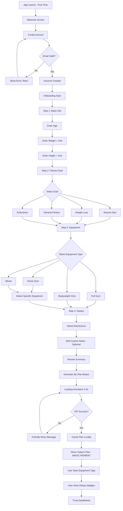
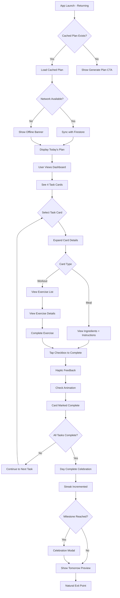
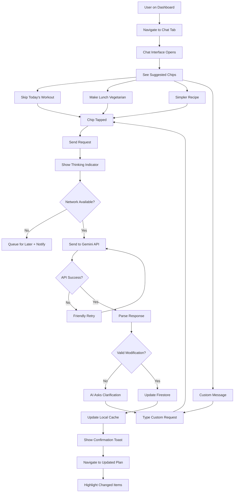
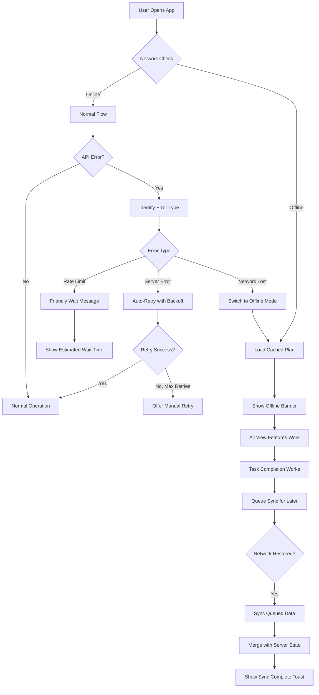
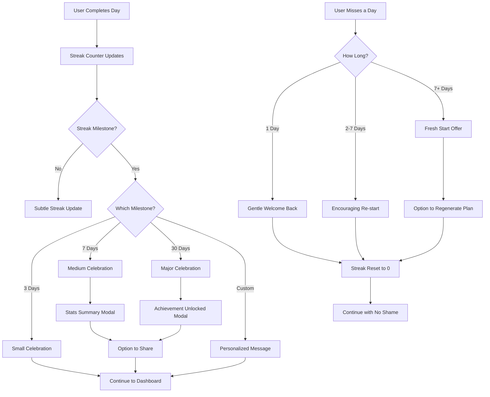

# UX Design Specification - FitGenie

**Author:** RusithHansana 
**Date:** 2025-12-21  
**Version:** 1.0  
**Status:** Complete

---

## Executive Summary

### Project Vision

FitGenie reimagines personal fitness by making premium, personalized guidance accessible to everyone. Where traditional fitness apps offer static templates, FitGenie creates truly customized experiences using Generative AI—adapting to each user's unique equipment, dietary needs, and lifestyle constraints. The experience should feel like having a knowledgeable friend who happens to be a personal trainer and nutritionist, available 24/7.

**Core Experience Promise:** Open the app → See YOUR plan for TODAY → Do the workout → Eat the meals → Feel accomplished → Come back tomorrow.

### Target Users

**Primary User: The Underserved Home Gym Enthusiast**
*Represented by Alex Chen*

Alex has been meaning to get in shape for years but every fitness app assumes he has access to a full commercial gym. He has dumbbells, a pull-up bar, and a yoga mat—and that's exactly what he needs the app to work with. He's vegetarian with a nut allergy, works long hours as a software developer, and needs simple meal prep. His current frustration: "Why do all these apps show me exercises I literally can't do?"

**Secondary User: The Time-Starved Professional**
*Represented by Maria Santos*

Maria's life is chaos—two kids, demanding job, gym access only twice a week. She needs an app that understands flexibility. Monday she's at the gym; Tuesday she's doing bodyweight exercises before the kids wake up. She's lactose intolerant and following a low-carb approach. Her current frustration: "I don't need a rigid plan, I need something that works around my actual life."

**Tertiary User: App Administrator**
*Represented by the developer (Rusit)*

Needs visibility into user adoption and engagement metrics for portfolio demonstration. Admin experience focuses on aggregate analytics, not individual user data.

### Key Design Challenges

1. **Onboarding Friction vs. Data Quality** - The AI needs comprehensive input to generate truly personalized plans, but every additional form field risks abandonment. We must design onboarding that feels like helpful conversation, not interrogation.

2. **Communicating AI Personalization** - Users are skeptical of "personalized" claims after years of apps that just filter templates. We need to make the genuine customization tangible and visible from the first generated plan.

3. **Offline Experience Coherence** - The app must feel fully functional offline while gracefully communicating what requires connectivity. Users shouldn't feel punished for being in a subway tunnel.

4. **Modification Request Clarity** - Natural language chat is powerful but ambiguous. Users need guidance on what modifications are possible, and the system needs to handle misunderstandings gracefully.

5. **Daily Engagement Loop** - This is a habit app. The daily experience must be frictionless enough to maintain streaks while meaningful enough to feel valuable, not just checkbox-checking.

### Design Opportunities

1. **Equipment Awareness as Differentiator** - Visually emphasizing that workouts use only the user's specific equipment creates immediate trust and differentiation from generic fitness apps.

2. **Intelligent Modification Suggestions** - Rather than relying solely on free-form chat, offering contextual quick-action chips ("Skip workout", "Make vegetarian", "Simpler recipe") reduces friction while teaching users the system's capabilities.

3. **Streak Psychology & Micro-Celebrations** - Thoughtful celebration of task completion and streak milestones creates positive reinforcement loops that drive retention.

4. **Progressive Disclosure** - Show the most important information immediately (today's plan) while making weekly views and historical data easily accessible for users who want more depth.

5. **Portfolio-Quality Craft** - Every interaction is an opportunity to demonstrate professional polish—smooth animations, thoughtful error states, and attention to detail that showcases premium development capabilities.

---

## Core User Experience

### Defining Experience

**Core Interaction:** The daily check-in ritual defines FitGenie. Users open the app expecting to see their personalized plan for TODAY—not a dashboard with options, not a menu of features, but an immediate answer to "What do I do right now?"

**The Core Loop:**
```
Open App → See Today's Plan → Do Workout → Eat Meals → Check Off Tasks → See Streak Grow → Close App → Come Back Tomorrow
```

This loop must feel effortless. Each step should flow naturally into the next with minimal cognitive load. The experience should feel like having a supportive coach who already knows what you need.

**First-Time Magic:** The moment a user sees their first generated plan—with workouts that use only THEIR equipment and meals that respect ALL their dietary restrictions—is the critical conversion moment. This is when skepticism transforms into trust.

### Platform Strategy

**Primary Platform:** Mobile (iOS & Android)
- Framework: Flutter (single codebase)
- Minimum Support: iOS 12.0+, Android API 21 (Lollipop+)
- Primary Interaction: Touch-based

**Platform Design Principles:**
- Touch targets minimum 44pt for comfortable tapping
- Swipe gestures for natural day navigation
- Haptic feedback on task completion
- Support system dark/light mode preference

**Offline-First Architecture:**
- All generated plans cached locally via Hive
- Full plan access without network connectivity
- Subtle offline indicator (non-intrusive banner)
- Queue modifications for sync when online

**Secondary Platform:** Flutter Web (Admin Dashboard)
- Read-only analytics view
- Aggregate user statistics
- No individual user data exposure

### Effortless Interactions

**Must Be Completely Frictionless:**

| Interaction          | Effort Level                     | Implementation                        |
| -------------------- | -------------------------------- | ------------------------------------- |
| View today's plan    | Zero-tap (immediate on app open) | Today's plan is default view          |
| Mark task complete   | Single-tap                       | Checkbox with instant haptic feedback |
| Navigate days        | Single swipe                     | Horizontal swipe or tab bar           |
| Start workout        | Single-tap                       | Large primary action button           |
| Request modification | Type + send                      | Chat interface with suggested chips   |

**Friction Reduction Strategies:**
- No confirmation dialogs for completing tasks (undo available instead)
- Skeleton loading screens instead of spinners
- Preload adjacent days for instant swipe navigation
- Remember last viewed position on app resume

### Critical Success Moments

**1. First Plan Generation (The "Magic Moment")**
- User completes onboarding and taps "Generate My Plan"
- Loading animation plays (4-5 seconds) with engaging visuals
- Plan appears with equipment-specific workouts and diet-compliant meals
- *Success Signal:* User thinks "Finally, an app that actually gets me"

**2. First Completed Day**
- User marks all daily tasks complete
- Streak counter starts (🔥 1 day)
- Subtle celebration animation
- Tomorrow's plan preview appears
- *Success Signal:* User feels accomplished and curious about tomorrow

**3. First Modification Request**
- User opens chat and makes a natural language request
- AI understands and regenerates relevant portion
- Changes appear immediately in plan view
- *Success Signal:* User trusts the AI assistant

**4. First Offline Access**
- User opens app without network
- Cached plan loads instantly
- Small offline banner appears
- All viewing and completion features work normally
- *Success Signal:* User trusts app reliability

**5. First Streak Milestone (7 Days)**
- Prominent celebration on completing week 1
- Share option (optional)
- Progress insight ("You've completed 21 meals and 5 workouts!")
- *Success Signal:* User feels committed and motivated to continue

### Experience Principles

These principles guide all UX decisions for FitGenie:

**1. "Today First" Principle**
*What matters most is what's happening right now.*
The default view is always today. Historical data and future planning are accessible but secondary.

**2. "Earned Personalization" Principle**
*Every piece of user data collected must visibly improve their experience.*
If we ask for equipment preferences, workouts must obviously reflect them. No data collection without visible benefit.

**3. "Invisible Complexity" Principle**
*The AI does the hard work; the user sees only simple results.*
Users never see prompts, JSON parsing, or API calls. They see their plan, updated magically.

**4. "Gentle Accountability" Principle**
*Encourage without guilt-tripping.*
Streaks motivate, but missing a day doesn't trigger shame messaging. Focus on "welcome back" rather than "you broke your streak."

**5. "Offline Equality" Principle**
*Offline users are first-class citizens.*
Cached plans work fully offline. Online-required features (generation, modification) are clearly indicated but don't break the core experience.

---

## Desired Emotional Response

### Primary Emotional Goals

**Core Emotional Experience:** Users should feel genuinely *understood* by FitGenie—like having access to a personal trainer who knows their situation intimately. This is the emotional differentiator from competitors who offer generic "personalization."

**The Four Pillars of Emotional Design:**

1. **Understood** → "This app knows my situation"
   - Equipment-specific workouts validate the onboarding effort
   - Dietary restrictions are never violated
   - The AI remembers context and preferences

2. **Capable** → "I can actually do this"
   - Workouts match available equipment and fitness level
   - Recipes are achievable with normal kitchen skills
   - Progress is incremental and visible

3. **Accomplished** → "I'm making real progress"
   - Daily task completion feels meaningful
   - Streak tracking provides visible momentum
   - Weekly summaries celebrate effort

4. **Supported** → "I have help when I need it"
   - Chat modifications feel like talking to a coach
   - Error states are reassuring, not alarming
   - The app never judges or shames

### Emotional Journey Mapping

**Phase 1: Discovery → Onboarding**
- *Initial Emotion:* Hopeful skepticism ("I've tried fitness apps before...")
- *Target Emotion:* Engaged curiosity ("This one is asking the right questions")
- *Design Approach:* Conversational onboarding that explains WHY each question matters

**Phase 2: First Plan Generation**
- *Initial Emotion:* Anticipation ("Let's see if this is real...")
- *Target Emotion:* **Delighted amazement** ("This actually gets me!")
- *Design Approach:* Engaging loading animation, then plan that OBVIOUSLY reflects their inputs
- *This is the critical conversion moment*

**Phase 3: Daily Usage**
- *Initial Emotion:* Morning focus ("What do I do today?")
- *Target Emotion:* Confident action ("Got it, let's go")
- *Design Approach:* Immediate clarity, zero navigation to today's plan

**Phase 4: Task Completion**
- *Initial Emotion:* Effort exerted
- *Target Emotion:* Accomplishment and satisfaction
- *Design Approach:* Immediate haptic + visual feedback, streak update

**Phase 5: Returning Users**
- *Regular Return Emotion:* Comfortable routine ("My daily check-in")
- *After-Lapse Return Emotion:* Welcomed back, not shamed
- *Design Approach:* Fresh start options, no guilt messaging

### Micro-Emotions

**Positive Micro-Emotions to Create:**

| Moment                      | Micro-Emotion | Design Element                      |
| --------------------------- | ------------- | ----------------------------------- |
| Seeing equipment in workout | Recognition   | Equipment tags visible on exercises |
| Dietary restriction honored | Trust         | Dietary badges on meals             |
| Completing workout          | Pride         | Check animation + "Nice work!"      |
| Reaching streak milestone   | Achievement   | Celebration modal with stats        |
| AI understands modification | Relief        | Quick, accurate response            |
| Offline access works        | Confidence    | Seamless cached plan load           |

**Negative Micro-Emotions to Prevent:**

| Moment                          | Risk Emotion | Prevention Strategy                               |
| ------------------------------- | ------------ | ------------------------------------------------- |
| Can't find today's plan         | Frustration  | Today is ALWAYS the default view                  |
| Don't understand exercise       | Confusion    | Clear name + sets/reps + instructions             |
| Network fails during generation | Anxiety      | Friendly message + auto-retry                     |
| Missed multiple days            | Shame        | "Welcome back" messaging, no streak shame         |
| Chat not understood             | Doubt        | Suggested modification chips + clarification flow |

### Emotional Design Principles

**1. Celebration Without Condescension**
Acknowledge achievements appropriately—a first completed workout deserves recognition, but don't treat users like children. The tone should be encouraging friend, not enthusiastic kindergarten teacher.

**2. Failure Forgiveness**
When users miss days, break streaks, or skip workouts, the app should focus on fresh starts, not past failures. "Ready to get back to it?" not "You haven't worked out in 5 days."

**3. Visible Personalization**
Don't just personalize—SHOW the personalization. Equipment tags on workouts, dietary badges on meals. Make users SEE that this plan was made for them.

**4. Instant Gratification Loops**
Every action should have immediate feedback. Tap checkbox → haptic + animation + streak update. The dopamine hit encourages the next action.

**5. Calm Confidence in Errors**
When things go wrong (API failures, network issues), the messaging should be reassuring and solution-oriented. "Our AI is taking a quick break. Retrying..." not "Error 503: Service Unavailable."

---

## UX Pattern Analysis & Inspiration

### Inspiring Products Analysis

**Duolingo - Habit Formation Excellence**
*Relevance: Streak psychology and daily engagement*

| What They Nail                                 | Application to FitGenie                     |
| ---------------------------------------------- | ------------------------------------------- |
| Streak mechanics that motivate without shaming | Streak counter with "gentle accountability" |
| Daily goals that feel achievable               | Today's Plan as single focused view         |
| Celebratory feedback on completion             | Haptic + animation on task completion       |
| Offline lessons available                      | Cached plans work fully offline             |
| Progress visualization                         | Weekly completion stats and trends          |

*Key Insight:* Duolingo proves that consistent micro-commitments with immediate feedback create lasting habits. FitGenie's daily check-in loop should feel equally rewarding.

**Nike Training Club - Premium Fitness UX**
*Relevance: Workout presentation and equipment handling*

| What They Nail                  | Application to FitGenie                   |
| ------------------------------- | ----------------------------------------- |
| Beautiful exercise presentation | Clean workout cards with exercise details |
| Equipment filtering             | Equipment tags visible on exercises       |
| Professional photography feel   | High-quality visual design throughout     |
| Workout timing and rest         | Exercise cards show sets, reps, rest time |

*Key Insight:* Users expect fitness apps to feel premium. Visual polish communicates quality and justifies user investment.

**ChatGPT - Conversational AI Patterns**
*Relevance: Chat modification interface*

| What They Nail                | Application to FitGenie               |
| ----------------------------- | ------------------------------------- |
| Clean, focused chat interface | Modification chat with minimal chrome |
| Typing/thinking indicators    | "Updating your plan..." loading state |
| Error recovery patterns       | Friendly retry on API failures        |
| Natural conversation flow     | AI responses feel human, not robotic  |

*Key Insight:* Users are now familiar with AI chat patterns from ChatGPT. FitGenie's modification chat should feel equally natural.

**Calm/Headspace - Wellness App Tone**
*Relevance: Emotional design and welcome-back experiences*

| What They Nail                  | Application to FitGenie                |
| ------------------------------- | -------------------------------------- |
| Non-judgmental return messaging | "Ready when you are" after missed days |
| Celebration without excess      | Acknowledging without patronizing      |
| Calming error states            | Reassuring messaging when things fail  |
| Personalized greetings          | Morning context-aware welcome          |

*Key Insight:* Wellness apps have mastered the "gentle accountability" tone FitGenie needs. Never shame, always encourage.

### Transferable UX Patterns

**Navigation Patterns:**
| Pattern                | Source               | FitGenie Application               |
| ---------------------- | -------------------- | ---------------------------------- |
| Today-first navigation | Duolingo             | Dashboard defaults to today's plan |
| Horizontal day swiping | Calendar apps        | Swipe left/right to navigate days  |
| Bottom tab bar         | iOS/Android standard | Plan, Chat, Profile navigation     |

**Interaction Patterns:**
| Pattern                 | Source        | FitGenie Application                   |
| ----------------------- | ------------- | -------------------------------------- |
| Single-tap completion   | Todo apps     | Checkbox tasks with instant feedback   |
| Undo instead of confirm | Gmail         | Complete tasks immediately, offer undo |
| Skeleton loading        | Modern apps   | Content placeholders during load       |
| Pull-to-refresh         | Native mobile | Refresh plan data manually             |

**Feedback Patterns:**
| Pattern              | Source           | FitGenie Application               |
| -------------------- | ---------------- | ---------------------------------- |
| Haptic on action     | Fitness apps     | Vibration on task completion       |
| Streak counter       | Duolingo         | Visible streak in dashboard header |
| Progress rings       | Apple Watch      | Daily completion visualization     |
| Confetti celebration | Achievement apps | Milestone celebrations             |

**AI Chat Patterns:**
| Pattern           | Source         | FitGenie Application              |
| ----------------- | -------------- | --------------------------------- |
| Suggested prompts | ChatGPT        | Quick modification chips          |
| Typing indicator  | Messaging apps | "Thinking..." while AI processes  |
| Context memory    | AI assistants  | AI remembers current plan context |

### Anti-Patterns to Avoid

**1. Feature Overwhelm (MyFitnessPal)**
- Too many tabs, options, and settings
- Users paralyzed by choice
- *FitGenie Alternative:* Ruthless simplicity—Today's Plan is 90% of the experience

**2. Premium Wall Frustration (Most Fitness Apps)**
- Core features locked behind subscription
- Users feel baited and frustrated
- *FitGenie Alternative:* MVP is fully functional; premium adds convenience, not capability

**3. Shame Messaging (Old-School Fitness Apps)**
- "You haven't worked out in 5 days!"
- Guilt-tripping erodes trust
- *FitGenie Alternative:* "Welcome back! Ready to pick up where you left off?"

**4. Video Dependency (Nike Training Club)**
- Workouts require streaming video
- Fails offline, burns data
- *FitGenie Alternative:* Text + image exercise instructions work offline

**5. Generic "Personalization" (Template-Based Apps)**
- "Personalized" plans that look identical
- Users see through the marketing
- *FitGenie Alternative:* VISIBLY different plans based on equipment and restrictions

**6. Confirmation Dialog Friction**
- "Are you sure you want to mark this complete?"
- Slows down the core loop
- *FitGenie Alternative:* Immediate completion with undo available

### Design Inspiration Strategy

**ADOPT These Patterns:**
| Pattern                      | Why                       | Implementation Priority |
| ---------------------------- | ------------------------- | ----------------------- |
| Duolingo streak mechanics    | Proven habit formation    | High - Core feature     |
| Single-tap task completion   | Reduces friction          | High - Core interaction |
| Skeleton loading screens     | Modern, professional feel | Medium - Polish         |
| Suggested modification chips | Reduces AI friction       | High - Chat usability   |
| Haptic feedback              | Immediate gratification   | Medium - Delight        |

**ADAPT These Patterns:**
| Pattern                         | Modification Needed            | Reason                |
| ------------------------------- | ------------------------------ | --------------------- |
| Nike Training Club premium feel | Lighter, faster (no video)     | Offline + performance |
| ChatGPT chat interface          | Simpler, task-focused          | Not general chat      |
| Duolingo celebrations           | More subtle for adult audience | Age-appropriate tone  |

**AVOID These Patterns:**
| Pattern               | Why                     | Alternative            |
| --------------------- | ----------------------- | ---------------------- |
| Tabbed complexity     | Overwhelms casual users | Today-first simplicity |
| Video-only exercises  | Fails offline           | Text + images          |
| Shame-based messaging | Erodes trust            | Gentle accountability  |
| Confirmation dialogs  | Slows core loop         | Undo instead           |

---

## Design System Foundation

### Design System Choice

**Selected System:** Material Design 3 (Material You) with Custom Theme  
**Framework:** Flutter Material Components  
**Documentation:** [material.io/design](https://m3.material.io/)

**Why Material Design 3:**

| Benefit                | Application to FitGenie                                 |
| ---------------------- | ------------------------------------------------------- |
| Native Flutter support | Zero additional dependencies, optimal performance       |
| Dynamic color theming  | Android 12+ can adapt to user's wallpaper colors        |
| Built-in accessibility | Touch targets, contrast, screen reader support included |
| Proven patterns        | Users already know how MD3 apps work                    |
| Dark mode native       | System appearance preference support trivial            |
| Portfolio-ready        | Shows ability to customize standard systems             |

### Rationale for Selection

**Primary Reasons:**

1. **Flutter-Native Advantage** - Material 3 components are part of the Flutter SDK. No third-party package maintenance, no version compatibility issues, optimal bundle size and performance.

2. **Portfolio Balance** - Using a recognized design system with custom theming demonstrates practical design skills. Clients understand you can work within constraints while adding personality.

3. **Development Speed** - Solo developer project. Pre-built, accessible, well-documented components let you focus on AI integration and unique features rather than rebuilding buttons.

4. **Professional Baseline** - Material 3 provides a professional foundation. Custom colors, typography, and subtle animations make it feel unique without starting from scratch.

**What We're NOT Doing:**
- Fully custom design system (too time-consuming for portfolio project)
- Cupertino-only (Flutter strength is cross-platform consistency)
- Third-party systems like Chakra (not applicable to Flutter)

### Implementation Approach

**Flutter Material 3 Configuration:**

```dart
// Theme configuration approach
MaterialApp(
  theme: ThemeData(
    useMaterial3: true,
    colorScheme: ColorScheme.fromSeed(
      seedColor: FitGenieBrand.primaryColor,
      brightness: Brightness.light,
    ),
    // Custom typography scale
    textTheme: FitGenieTypography.textTheme,
  ),
  darkTheme: ThemeData(
    useMaterial3: true,
    colorScheme: ColorScheme.fromSeed(
      seedColor: FitGenieBrand.primaryColor,
      brightness: Brightness.dark,
    ),
  ),
  themeMode: ThemeMode.system,
);
```

**Component Usage Strategy:**

| Component Type | Approach                                            |
| -------------- | --------------------------------------------------- |
| Buttons        | Material 3 FilledButton, OutlinedButton, TextButton |
| Cards          | Material 3 Card with custom border radius           |
| Navigation     | Material 3 NavigationBar (bottom)                   |
| Inputs         | Material 3 TextField, Checkbox, Switch              |
| Dialogs        | Material 3 AlertDialog, BottomSheet                 |
| Loading        | Custom skeleton + CircularProgressIndicator         |

### Customization Strategy

**What We Customize:**

1. **Color Palette** - Custom seed color generating cohesive scheme
2. **Typography** - Custom font family with MD3 type scale
3. **Border Radius** - Slightly softer than MD3 defaults (16dp instead of 12dp)
4. **Elevation & Shadows** - Subtle, modern shadow treatment
5. **Animation Curves** - Custom spring animations for delight
6. **Component Variants** - Exercise cards, meal cards, streak badges

**What We Keep Default:**
- Touch target sizes (44x44 minimum)
- Color role semantics (primary, secondary, error, surface)
- Navigation patterns
- State feedback (pressed, focused, disabled)

**Custom Components to Build:**

| Component        | Reason                                           |
| ---------------- | ------------------------------------------------ |
| ExerciseCard     | Domain-specific layout with sets/reps/equipment  |
| MealCard         | Domain-specific layout with ingredients/calories |
| StreakBadge      | Custom celebration animation                     |
| DayPicker        | Horizontal scrolling day selector                |
| ModificationChip | Quick action chips for chat                      |
| OfflineBanner    | Subtle connectivity indicator                    |

### Design Token Strategy

**Color Tokens:**
```
--color-primary: Seed color for ColorScheme.fromSeed()
--color-on-primary: Auto-generated contrast color
--color-secondary: Complementary accent
--color-surface: Background surfaces
--color-error: Validation and error states
--color-success: Completion and positive states
```

**Typography Tokens:**
```
--text-display-large: Streak numbers, celebrations
--text-headline-medium: Section headers
--text-title-large: Card titles, day names
--text-body-large: Exercise instructions, meal details
--text-body-medium: Supporting text
--text-label-large: Button text, chips
```

**Spacing Tokens:**
```
--space-xs: 4dp
--space-sm: 8dp
--space-md: 16dp
--space-lg: 24dp
--space-xl: 32dp
```

**Border Radius Tokens:**
```
--radius-sm: 8dp (chips, small elements)
--radius-md: 16dp (cards, buttons)
--radius-lg: 24dp (modals, large surfaces)
--radius-full: 999dp (circles, pills)
```

---

## Defining Experience

### The Core Interaction

**FitGenie's Defining Experience:**
> "Open the app → See YOUR personalized plan for TODAY → Do it → Come back tomorrow"

**The 3-Second Test:** When a user opens FitGenie, they should know exactly what to do today within 3 seconds. No navigation, no decisions, no cognitive load—just immediate clarity.

**How Users Describe It:**
*"I just open the app and it tells me exactly what to do—workout AND meals—and it's actually made for my equipment and my diet restrictions. It's like having a personal trainer who knows my situation."*

**Why This Is the Defining Moment:**
Every other feature (chat modifications, streak tracking, offline access) supports this core experience. If we nail the "open → see today → do it" loop, users form habits. If we fail, nothing else matters.

### User Mental Model

**Mental Model Shift:**

| Before FitGenie                     | With FitGenie                           |
| ----------------------------------- | --------------------------------------- |
| "What should I do today?"           | "Let me check what my plan says"        |
| "I need to figure this out"         | "The app already figured it out for me" |
| "Do I have the equipment for this?" | "Of course—it knows what I have"        |
| "Will this meal work for my diet?"  | "Everything's already been filtered"    |

**Trust-Building Progression:**
1. **First Plan:** Skepticism → "Wait, this actually fits my situation"
2. **First Week:** Curiosity → "The AI really does understand"
3. **Ongoing Use:** Trust → "I just do what the app says"

**Key Mental Model Requirement:**
The personalization must be *visibly* different from generic apps. When Alex sees "Dumbbell Rows" and "Pull-ups" (his equipment) instead of "Barbell Bench Press" (gym equipment he doesn't have), trust forms instantly.

### Success Criteria

**Core Experience Success Metrics:**

| Criteria                        | Target                       | Measurement  |
| ------------------------------- | ---------------------------- | ------------ |
| Time to understand today's plan | <3 seconds                   | User testing |
| Navigation taps to see today    | 0 (default view)             | Analytics    |
| Personalization visibility      | 100% see equipment/diet tags | User testing |
| Daily return rate               | >60% of active users         | Analytics    |
| Task completion rate            | >70% of daily tasks          | Firebase     |
| Streak maintenance              | Average >5 days              | Database     |

**Qualitative Success Indicators:**
- Users describe app as "personalized" or "made for me"
- Users recommend to friends with specific situations
- Users trust AI modifications without second-guessing
- Users feel accomplishment, not obligation

### Novel UX Patterns

**Pattern Classification:**

| Pattern                           | Type         | Justification                      |
| --------------------------------- | ------------ | ---------------------------------- |
| Today-first navigation            | Established  | Calendar apps, Duolingo            |
| AI-generated personalized content | Novel        | Unique to FitGenie                 |
| Equipment tags on exercises       | Novel        | Makes personalization visible      |
| Dietary badges on meals           | Novel        | Makes personalization visible      |
| Streak tracking                   | Established  | Duolingo, fitness apps             |
| Chat modification                 | Novel hybrid | ChatGPT patterns + fitness context |

**Novel Pattern: Visible Personalization Tags**
Unlike other fitness apps that claim personalization but show identical content, FitGenie explicitly shows WHY content was generated:
- Exercise cards show equipment used: `🏋️ Dumbbells` `🔗 Pull-up bar`
- Meal cards show dietary compliance: `🥬 Vegetarian` `🚫 Nut-free`

This transforms invisible personalization into trust-building visible proof.

**Novel Pattern: Modification via Chat**
Users can type natural language requests: "Swap Tuesday's lunch for something quicker"
AI processes, regenerates affected portions, and updates the plan.
This is novel for fitness apps but familiar from ChatGPT, reducing learning curve.

### Experience Mechanics

**The Daily Loop - Detailed Flow:**

```
1. INITIATION
   ├── User opens app (cold start or background resume)
   ├── App loads cached plan immediately (Hive)
   ├── Today's date highlighted, plan displayed
   └── Streak counter visible in header

2. ORIENTATION (3-second test)
   ├── Glanceable layout: Breakfast | Workout | Lunch | Dinner
   ├── Completion checkboxes visible
   ├── Equipment/dietary tags visible on cards
   └── Current progress clear: "2/4 tasks complete"

3. INTERACTION
   ├── Tap meal card → Expand to see ingredients/instructions
   ├── Tap workout card → Expand to see exercise list
   ├── Tap exercise → See sets/reps/rest time/instructions
   ├── Tap checkbox → Mark complete (haptic + animation)
   └── Swipe left/right → Navigate to other days

4. FEEDBACK
   ├── Checkbox: Haptic vibration + check animation
   ├── All tasks complete: Celebration + streak update
   ├── Milestone reached: Confetti + stats modal
   └── Plan modified: Toast confirmation + updated content

5. COMPLETION
   ├── Daily completion: "Great job! See you tomorrow 💪"
   ├── Tomorrow's preview appears
   ├── Streak counter increments
   └── Natural exit point reached
```

**Error Handling in Core Experience:**

| Error                   | User Experience                    | Recovery                |
| ----------------------- | ---------------------------------- | ----------------------- |
| Offline on launch       | Cached plan loads normally         | Subtle offline banner   |
| No plan generated yet   | Welcome + "Generate Plan" CTA      | One-tap generation      |
| Plan generation fails   | Friendly retry message             | Auto-retry with backoff |
| Chat modification fails | "Couldn't update, trying again..." | Auto-retry              |

---

## Visual Design Foundation

### Color System

**Color Philosophy:**
FitGenie's colors should evoke *energy with approachability*. We want users to feel motivated (not intimidated), confident (not overwhelmed), and healthy (not clinical). The palette balances warm energetic tones with cool trustworthy accents.

**Primary Color: Energetic Coral**
```
Seed Color: #F97316 (Vivid Orange)
```
This warm orange serves as the seed for Material 3's ColorScheme.fromSeed(), generating a harmonious palette automatically.

**Why This Color:**
- **Energy & Motivation:** Orange evokes action, enthusiasm, and forward momentum
- **Approachability:** Warmer than aggressive red, friendlier than corporate blue
- **Differentiation:** Stands out in fitness app marketplace (dominated by blues/greens)
- **Portfolio Impact:** Memorable, confident, premium

**Semantic Color Mapping:**

| Role            | Light Mode     | Dark Mode | Usage                                    |
| --------------- | -------------- | --------- | ---------------------------------------- |
| Primary         | #F97316        | #FB923C   | Primary actions, highlights, streak fire |
| On Primary      | #FFFFFF        | #1C1917   | Text on primary surfaces                 |
| Secondary       | #06B6D4 (Cyan) | #22D3EE   | Accent elements, workout category        |
| Tertiary        | #84CC16 (Lime) | #A3E635   | Success, completion, streak              |
| Error           | #DC2626        | #F87171   | Validation errors                        |
| Surface         | #FAFAF9        | #1C1917   | Card backgrounds                         |
| On Surface      | #1C1917        | #FAFAF9   | Primary text                             |
| Surface Variant | #F5F5F4        | #292524   | Secondary surfaces                       |

**Functional Colors:**

| Purpose       | Color             | Usage                         |
| ------------- | ----------------- | ----------------------------- |
| Workout       | Cyan (#06B6D4)    | Workout cards, exercise icons |
| Nutrition     | Green (#22C55E)   | Meal cards, dietary badges    |
| Streak        | Orange (#F97316)  | Streak counter, fire emoji    |
| Completed     | Lime (#84CC16)    | Checkmarks, completion states |
| Equipment Tag | Neutral (#737373) | Equipment badge backgrounds   |
| Dietary Tag   | Teal (#14B8A6)    | Dietary restriction badges    |

**Accessibility Compliance:**
- All text on backgrounds meets WCAG 2.1 AA (4.5:1 contrast ratio minimum)
- Interactive elements meet 3:1 contrast for icons/graphics
- Error states have both color AND icon indicators (not color-dependent)

### Typography System

**Typography Philosophy:**
FitGenie's typography should be *scannable and actionable*. Users glance at their daily plan—headings must be clear, body text must be readable during workouts, and the overall feeling should be modern and confident.

**Primary Typeface: Inter**
- Sans-serif, modern, highly legible
- Excellent screen rendering at all sizes
- Open source, included in Google Fonts
- Wide weight range for hierarchy

**Secondary Typeface: Inter (Display Optical Size)**
- Same family for consistency
- Used for large display text (streak numbers)

**Type Scale (Material 3 Adapted):**

| Style           | Size | Weight         | Line Height | Usage                               |
| --------------- | ---- | -------------- | ----------- | ----------------------------------- |
| Display Large   | 57sp | Bold (700)     | 64sp        | Streak number, celebrations         |
| Display Medium  | 45sp | Bold (700)     | 52sp        | Milestone numbers                   |
| Headline Large  | 32sp | SemiBold (600) | 40sp        | Screen titles                       |
| Headline Medium | 28sp | SemiBold (600) | 36sp        | Section headers                     |
| Title Large     | 22sp | Medium (500)   | 28sp        | Card titles, day names              |
| Title Medium    | 16sp | Medium (500)   | 24sp        | Subsection headers                  |
| Body Large      | 16sp | Regular (400)  | 24sp        | Exercise instructions, meal details |
| Body Medium     | 14sp | Regular (400)  | 20sp        | Supporting text, descriptions       |
| Body Small      | 12sp | Regular (400)  | 16sp        | Captions, timestamps                |
| Label Large     | 14sp | Medium (500)   | 20sp        | Button text, chips                  |
| Label Medium    | 12sp | Medium (500)   | 16sp        | Small buttons, tags                 |

**Typography Best Practices:**
- Maximum 60-70 characters per line for readability
- Adequate line height for scanning during workouts
- Bold weights for actionable elements
- Regular weights for informational content

### Spacing & Layout Foundation

**Spacing Philosophy:**
FitGenie's layout should feel *organized but not cramped*. Users view their plan at a glance—adequate white space creates clarity, but we don't want excessive scrolling.

**Base Spacing Unit: 4dp**
All spacing derives from multiples of 4dp for visual consistency.

**Spacing Scale:**

| Token       | Value | Usage                          |
| ----------- | ----- | ------------------------------ |
| --space-2xs | 2dp   | Icon-to-text gaps              |
| --space-xs  | 4dp   | Compact internal padding       |
| --space-sm  | 8dp   | Standard internal padding      |
| --space-md  | 16dp  | Card padding, list item gaps   |
| --space-lg  | 24dp  | Section spacing                |
| --space-xl  | 32dp  | Major section breaks           |
| --space-2xl | 48dp  | Screen edge margins on tablets |

**Layout Grid:**
- Mobile: Single column, 16dp edge margins
- Tablet: Responsive grid, 24dp gutters
- Maximum content width: 600dp (prevents over-stretching on tablets)

**Card Layout Principles:**
- Consistent 16dp internal padding
- 8dp gap between card elements
- 12dp gap between cards in lists
- 16dp radius for modern, soft appearance

**Touch Target Requirements:**
- Minimum 48x48dp for all interactive elements
- 44x44dp minimum for inline actions (checkboxes)
- 8dp minimum gap between adjacent touch targets

### Iconography

**Icon Style:**
- Material Symbols (Outlined, weight 400)
- 24dp standard size, 20dp for compact contexts
- Consistent 1.5dp stroke weight

**Custom Icon Requirements:**

| Icon            | Purpose                      | Style Notes                   |
| --------------- | ---------------------------- | ----------------------------- |
| Streak fire 🔥   | Streak counter               | Filled, animated on milestone |
| Equipment icons | Dumbbell, barbell, mat, etc. | Outlined, consistent weight   |
| Dietary icons   | Vegetarian, vegan, etc.      | Filled for visibility         |
| Check mark      | Task completion              | Animated on tap               |

### Elevation & Shadows

**Elevation Strategy:**
Material 3 uses tonal elevation (color change) over drop shadows, which works well for FitGenie's clean, modern aesthetic.

| Level | Tonal Shift     | Usage                             |
| ----- | --------------- | --------------------------------- |
| 0     | None            | Background surfaces               |
| 1     | +5% brightness  | Cards, containers                 |
| 2     | +8% brightness  | Raised buttons, floating elements |
| 3     | +11% brightness | Navigation bar, modals            |

**When to Use Shadows:**
- Floating action buttons (subtle shadow)
- Bottom sheets and modals (subtle shadow)
- Offline banner (minimal shadow to elevate)

### Animation & Motion

**Animation Philosophy:**
Animations should be *quick, purposeful, and satisfying*. Never delay user actions, but provide delightful feedback.

**Animation Timing:**

| Animation Type    | Duration  | Curve       | Usage                    |
| ----------------- | --------- | ----------- | ------------------------ |
| Micro-interaction | 100-200ms | Ease-out    | Checkbox, button press   |
| Transition        | 200-300ms | Ease-in-out | Screen navigation        |
| Emphasis          | 300-500ms | Spring      | Celebrations, milestones |
| Loading           | 1-2s loop | Linear      | Progress indicators      |

**Key Animations to Implement:**

| Element          | Animation                | Trigger           |
| ---------------- | ------------------------ | ----------------- |
| Checkbox         | Check mark draw + scale  | Task completion   |
| Streak counter   | Number increment + pulse | Streak update     |
| Celebration      | Confetti burst           | Milestone reached |
| Card expansion   | Height + fade-in content | Card tap          |
| Day navigation   | Horizontal slide         | Swipe gesture     |
| Loading skeleton | Shimmer wave             | Data fetch        |

**Haptic Feedback:**
- Light impact: Checkbox completion
- Medium impact: Streak milestone
- Selection feedback: Navigation tab change

### Accessibility Considerations

**Visual Accessibility:**

| Requirement        | Implementation                           |
| ------------------ | ---------------------------------------- |
| Color contrast     | 4.5:1 minimum for text, 3:1 for graphics |
| Color independence | Never rely on color alone for meaning    |
| Focus indicators   | 2dp outline on focused elements          |
| Motion sensitivity | Respect reduced-motion preference        |
| Text scaling       | Support up to 200% system font size      |

**Screen Reader Support:**
- All images have descriptive alt text
- Form fields have proper labels
- Interactive elements have accessibility labels
- Live regions for dynamic content updates

**Touch Accessibility:**
- 48x48dp minimum touch targets
- Adequate spacing between interactive elements
- No hover-dependent interactions (mobile-first)

---

## Design Direction

### Design Philosophy

**FitGenie Design Direction: "Energetic Coach"**

The visual design should feel like opening a message from a supportive, knowledgeable friend who happens to be a fitness expert. Energetic but not overwhelming, professional but approachable, personalized but not cluttered.

**Design Personality Keywords:**
- Energetic (not aggressive)
- Confident (not arrogant)
- Supportive (not condescending)
- Clear (not cluttered)
- Premium (not corporate)

### Core Design Elements

**Layout Philosophy: Card-Based Clarity**

| Element               | Approach                               |
| --------------------- | -------------------------------------- |
| Primary Container     | Cards with 16dp padding, 16dp radius   |
| Information Hierarchy | Task cards > Details on expansion      |
| Negative Space        | Generous but purposeful                |
| Visual Weight         | Medium—balanced between dense and airy |

**Navigation Philosophy: Three-Tab Simplicity**

| Tab         | Purpose                      | Icon          |
| ----------- | ---------------------------- | ------------- |
| **Plan**    | Today's plan, day navigation | Calendar/Home |
| **Chat**    | AI modifications             | Chat bubble   |
| **Profile** | Settings, stats, account     | Person        |

**Header Philosophy: Streak-Forward**

| Element           | Placement                | Purpose             |
| ----------------- | ------------------------ | ------------------- |
| Day indicator     | Left                     | Current day context |
| Streak counter    | Right                    | 🔥 Motivation        |
| Offline indicator | Top banner (conditional) | Connectivity status |

### Screen Layout Structure

**Dashboard (Plan Tab) - Default View:**
```
┌─────────────────────────────────┐
│ Monday, Dec 23          🔥 12   │ ← Header with streak
├─────────────────────────────────┤
│ [Mon][Tue][Wed][Thu][Fri][Sat]  │ ← Day selector (scroll)
├─────────────────────────────────┤
│ ┌─────────────────────────────┐ │
│ │ ☐ Breakfast                 │ │ ← Meal card (collapsed)
│ │   Protein Pancakes          │ │
│ │   🥬 Vegetarian             │ │
│ └─────────────────────────────┘ │
│ ┌─────────────────────────────┐ │
│ │ ☐ Morning Workout           │ │ ← Workout card (collapsed)
│ │   Upper Body • 45 min       │ │
│ │   🏋️ Dumbbells 🔗 Pull-up   │ │
│ └─────────────────────────────┘ │
│ ┌─────────────────────────────┐ │
│ │ ☑ Lunch                     │ │ ← Completed card
│ │   Quinoa Veggie Bowl        │ │
│ │   🥬 Vegetarian 🚫 Nut-free │ │
│ └─────────────────────────────┘ │
│ ┌─────────────────────────────┐ │
│ │ ☐ Dinner                    │ │
│ │   Grilled Tofu Stir-Fry     │ │
│ │   🥬 Vegetarian             │ │
│ └─────────────────────────────┘ │
├─────────────────────────────────┤
│ 🏠 Plan    💬 Chat    👤 Profile │ ← Bottom navigation
└─────────────────────────────────┘
```

**Card Expanded State (Workout):**
```
┌─────────────────────────────────┐
│ ☐ Morning Workout           ▼  │
│   Upper Body • 45 min          │
│   🏋️ Dumbbells 🔗 Pull-up bar  │
├─────────────────────────────────┤
│ Warm-up (5 min)                │
│   • Arm circles - 30 sec       │
│   • Jumping jacks - 1 min      │
├─────────────────────────────────┤
│ Exercises                      │
│ ┌───────────────────────────┐  │
│ │ Dumbbell Rows             │  │
│ │ 3 sets × 12 reps          │  │
│ │ Rest: 60 sec              │  │
│ └───────────────────────────┘  │
│ ┌───────────────────────────┐  │
│ │ Pull-ups                  │  │
│ │ 3 sets × 8 reps           │  │
│ │ Rest: 90 sec              │  │
│ └───────────────────────────┘  │
│ ... more exercises            │
└─────────────────────────────────┘
```

### Design Rationale

**Why "Energetic Coach" Direction:**

1. **Aligns with Emotional Goals**
   - Orange primary evokes energy, motivation, forward momentum
   - Card-based layout provides clarity and accomplishment feeling
   - Visible streak reinforces commitment

2. **Supports Core Experience**
   - Today's plan visible immediately (no navigation)
   - Single-tap task completion
   - Equipment/dietary tags visible = personalization proof

3. **Matches User Expectations**
   - Familiar patterns from Duolingo, fitness apps
   - Bottom navigation standard on mobile
   - Card interactions feel natural

4. **Portfolio-Ready Premium**
   - Clean, modern aesthetic
   - Demonstrates Material 3 customization skill
   - Professional polish throughout

**Key Differentiators from Competitors:**
- Visible personalization tags (equipment, dietary)
- Unified workout + nutrition in single view
- Chat modification access always visible
- Streak-forward motivation (like Duolingo)

### Implementation Guidelines

**Card Component Standards:**

```dart
// FitGenie Card Style
Card(
  shape: RoundedRectangleBorder(
    borderRadius: BorderRadius.circular(16),
  ),
  elevation: 0, // Use tonal elevation
  color: Theme.of(context).colorScheme.surface,
  child: Padding(
    padding: EdgeInsets.all(16),
    child: // Card content
  ),
)
```

**Interaction States:**

| State     | Visual Feedback                                       |
| --------- | ----------------------------------------------------- |
| Default   | Card at surface level                                 |
| Pressed   | Slight scale down (0.98), tonal shift                 |
| Completed | Checkbox filled, strikethrough title, reduced opacity |
| Disabled  | 50% opacity, non-interactive                          |

**Tag/Badge Standards:**

| Tag Type  | Background  | Text/Icon | Border Radius |
| --------- | ----------- | --------- | ------------- |
| Equipment | #F5F5F4     | #737373   | 8dp           |
| Dietary   | #14B8A6/20% | #14B8A6   | 8dp           |
| Completed | #84CC16/20% | #84CC16   | 8dp           |

**Navigation Bar Standards:**
- 3 items maximum
- Active item uses primary color
- Inactive items use onSurfaceVariant
- Labels always visible (not icon-only)

---

## User Journey Flows

### Journey 1: First-Time User Onboarding

**User:** New user who just downloaded FitGenie
**Goal:** Complete onboarding and receive first personalized plan
**Success:** User sees a plan that obviously reflects their inputs



**Key Moments:**

| Step              | Duration | Experience                            |
| ----------------- | -------- | ------------------------------------- |
| Welcome → Account | 30s      | Quick, standard flow                  |
| Basic Info        | 45s      | Simple numeric inputs                 |
| Goal Selection    | 10s      | Single-tap selection                  |
| Equipment         | 30s      | Visual selection with details         |
| Dietary           | 20s      | Multi-select with custom notes        |
| Generation        | 4-5s     | Engaging loading animation            |
| **Magic Moment**  | Instant  | Plan appears, personalization visible |

**Total Time to Value:** ~3 minutes from download to personalized plan

---

### Journey 2: Daily Check-In Ritual

**User:** Returning user starting their day
**Goal:** See today's plan and complete tasks
**Success:** All daily tasks completed, streak maintained



**Daily Flow States:**

| State           | Visual                           | User Action       |
| --------------- | -------------------------------- | ----------------- |
| Morning Entry   | Today's plan visible immediately | Glance at tasks   |
| Task Viewing    | Card expanded with details       | Read instructions |
| Task Completion | Checkbox tap                     | Single tap        |
| Day Complete    | All checkboxes filled            | View celebration  |
| Exit            | Tomorrow preview visible         | Close app         |

---

### Journey 3: Plan Modification via Chat

**User:** User with changing circumstances
**Goal:** Modify current plan through natural language
**Success:** Plan updated to reflect request



**Suggested Modification Chips:**

| Context     | Suggested Chips                               |
| ----------- | --------------------------------------------- |
| Morning     | "Skip today's workout", "Simpler breakfast"   |
| Workout Day | "Lower intensity", "Shorter workout"          |
| Meal Time   | "Different protein", "Quicker recipe"         |
| General     | "I'm sore today", "Change dietary preference" |

**AI Response Patterns:**

| Request Type       | AI Behavior                 |
| ------------------ | --------------------------- |
| Clear modification | Execute and confirm         |
| Ambiguous request  | Ask clarifying question     |
| Out of scope       | Explain limitation politely |
| Multiple changes   | Summarize all modifications |

---

### Journey 4: Error Recovery & Offline

**User:** User experiencing connectivity issues
**Goal:** Continue using app despite problems
**Success:** Graceful degradation, no data loss



**Error Messaging Philosophy:**

| Error   | Technical Cause   | User-Facing Message                                 |
| ------- | ----------------- | --------------------------------------------------- |
| 429     | Rate limit        | "Our AI is taking a quick break. Back in a moment!" |
| 500     | Server error      | "Something went wrong on our end. Retrying..."      |
| Network | Connectivity lost | "You're offline. Your plan is still available!"     |
| Timeout | Slow response     | "Taking longer than usual. Hang tight..."           |

---

### Journey 5: Streak Maintenance & Motivation

**User:** User building a habit
**Goal:** Maintain streak and stay motivated
**Success:** Long-term engagement through positive reinforcement



**Milestone Celebrations:**

| Milestone | Celebration Type  | Content                                   |
| --------- | ----------------- | ----------------------------------------- |
| 3 days    | Confetti burst    | "Great start! 🎉"                          |
| 7 days    | Modal with stats  | "One week strong! Here's what you did..." |
| 14 days   | Achievement badge | "Two-week warrior unlocked!"              |
| 30 days   | Major celebration | "30 days! You're in the top 5% of users"  |

**Welcome-Back Messaging (No Shame):**

| Gap     | Message                                                |
| ------- | ------------------------------------------------------ |
| 1 day   | "Ready to get back to it? Today's plan is waiting."    |
| 3 days  | "Hey! Life happens. Let's pick up where you left off." |
| 7+ days | "Welcome back! Want to start fresh with a new plan?"   |

---

### Flow Optimization Principles

**1. Minimize Steps to Value**
- Onboarding: 5 screens maximum
- Daily check-in: 0 taps to see today
- Task completion: 1 tap per task

**2. Progressive Disclosure**
- Show collapsed cards first
- Expand on tap for details
- Exercise instructions on secondary tap

**3. Always Provide Escape Hatches**
- Skip options in onboarding
- Undo for task completion
- Back navigation always available

**4. Feedback at Every Step**
- Loading states for all async operations
- Haptic feedback for completions
- Toast notifications for modifications

**5. Graceful Degradation**
- Offline mode is first-class
- Errors never block core experience
- Queued actions sync when possible

---

## Component Strategy

### Design System Components (Material 3)

**Primary Components Used:**

| Component                 | Material 3                  | FitGenie Usage               |
| ------------------------- | --------------------------- | ---------------------------- |
| Card                      | `Card`                      | Base for task cards          |
| Checkbox                  | `Checkbox`                  | Task completion              |
| NavigationBar             | `NavigationBar`             | Bottom navigation            |
| TextField                 | `TextField`                 | Chat input, onboarding forms |
| FilledButton              | `FilledButton`              | Primary actions              |
| OutlinedButton            | `OutlinedButton`            | Secondary actions            |
| TextButton                | `TextButton`                | Tertiary actions             |
| AlertDialog               | `AlertDialog`               | Confirmations                |
| BottomSheet               | `BottomSheet`               | Exercise details             |
| SnackBar                  | `SnackBar`                  | Toast notifications          |
| Chip                      | `Chip`                      | Modification suggestions     |
| CircularProgressIndicator | `CircularProgressIndicator` | Loading states               |

**Customization Approach:**
All Material 3 components will be themed using ColorScheme.fromSeed() with the FitGenie primary color (#F97316) to maintain visual consistency.

---

### Custom Components

#### TaskCard (Meal/Workout)

**Purpose:** Display daily plan items (meals and workouts) in a scannable, completeable format.

**Variants:**
- `MealTaskCard` - For breakfast, lunch, dinner
- `WorkoutTaskCard` - For workout sessions

**Anatomy:**
```
┌────────────────────────────────────┐
│ ☐ │ Title                      │ ▼ │  ← Header row
│   │ Subtitle • Duration            │
│   │ [Tag] [Tag] [Tag]             │  ← Personalization tags
├────────────────────────────────────┤
│ Expanded content (conditional)     │  ← Details on tap
│ • Ingredient or exercise list      │
│ • Instructions or sets/reps        │
└────────────────────────────────────┘
```

**States:**

| State     | Checkbox  | Card Appearance                      |
| --------- | --------- | ------------------------------------ |
| Default   | Unchecked | Full opacity, elevated               |
| Expanded  | Unchecked | Taller, shows content                |
| Completed | Checked   | Reduced opacity, strikethrough title |
| Disabled  | N/A       | 50% opacity, non-interactive         |

**Props:**
```dart
class TaskCard extends StatelessWidget {
  final TaskType type; // meal or workout
  final String title;
  final String subtitle;
  final List<String> tags;
  final bool isCompleted;
  final VoidCallback onComplete;
  final VoidCallback onTap;
  final Widget? expandedContent;
}
```

**Accessibility:**
- Checkbox has label: "Mark [title] as complete"
- Card is focusable for keyboard navigation
- Expansion state announced: "expanded" / "collapsed"

---

#### DayPicker

**Purpose:** Allow horizontal navigation between days of the weekly plan.

**Anatomy:**
```
← [Mon] [Tue] [Wed*] [Thu] [Fri] [Sat] [Sun] →
                ↑ Today highlighted
```

**States:**

| State                | Appearance                           |
| -------------------- | ------------------------------------ |
| Today                | Primary color background, white text |
| Selected (not today) | Primary color outline                |
| Has tasks            | Normal weight                        |
| All tasks complete   | Checkmark badge                      |
| Future               | Normal                               |
| Past (incomplete)    | Subtle indicator                     |

**Props:**
```dart
class DayPicker extends StatelessWidget {
  final DateTime selectedDate;
  final DateTime weekStart;
  final Map<DateTime, DayStatus> dayStatuses;
  final ValueChanged<DateTime> onDaySelected;
}

enum DayStatus { incomplete, partial, complete }
```

**Interaction:**
- Tap to select day
- Swipe gesture on parent view also changes selected day
- Horizontal scroll when 7 days don't fit

---

#### StreakBadge

**Purpose:** Display current streak count with motivational fire emoji.

**Anatomy:**
```
🔥 12
```

**States:**

| State              | Animation                    |
| ------------------ | ---------------------------- |
| Default            | Static display               |
| Incrementing       | Number counts up + pulse     |
| Milestone          | Confetti burst + glow        |
| New streak (was 0) | Fire icon appears with scale |

**Props:**
```dart
class StreakBadge extends StatelessWidget {
  final int streakCount;
  final bool animate;
  final bool isMilestone;
}
```

**Milestones:** 3, 7, 14, 21, 30, 60, 90, 100, 365 days

---

#### EquipmentTag / DietaryTag

**Purpose:** Show personalization proof—equipment used and dietary restrictions honored.

**Anatomy:**
```
Equipment: 🏋️ Dumbbells   🔗 Pull-up bar
Dietary:   🥬 Vegetarian  🚫 Nut-free
```

**Variants:**

| Type                    | Icon           | Background  | Text Color |
| ----------------------- | -------------- | ----------- | ---------- |
| Equipment               | Equipment icon | #F5F5F4     | #737373    |
| Dietary (vegetarian)    | 🥬              | #22C55E/15% | #15803D    |
| Dietary (vegan)         | 🌱              | #22C55E/15% | #15803D    |
| Dietary (allergen-free) | 🚫              | #EF4444/15% | #B91C1C    |
| Dietary (halal/kosher)  | ✓              | #06B6D4/15% | #0891B2    |

**Props:**
```dart
class PersonalizationTag extends StatelessWidget {
  final TagType type;
  final String label;
  final IconData? icon;
}

enum TagType { equipment, dietary, allergen }
```

---

#### ModificationChip

**Purpose:** Provide suggested quick actions for AI chat modifications.

**Anatomy:**
```
[💪 Skip today's workout] [🥗 Simpler recipe] [⏰ Quick meal]
```

**States:**

| State    | Appearance                     |
| -------- | ------------------------------ |
| Default  | Outlined chip with icon        |
| Pressed  | Primary fill, scale animation  |
| Disabled | 50% opacity (when offline)     |
| Loading  | Replace text with mini spinner |

**Props:**
```dart
class ModificationChip extends StatelessWidget {
  final String label;
  final IconData icon;
  final VoidCallback onTap;
  final bool isLoading;
  final bool isDisabled;
}
```

**Suggested Chips by Context:**

| Time of Day | Suggestions                                            |
| ----------- | ------------------------------------------------------ |
| Morning     | "Skip workout", "Simpler breakfast", "Less time today" |
| Midday      | "Different lunch", "Quicker recipe", "More protein"    |
| Evening     | "Lighter dinner", "Skip dessert", "Early day tomorrow" |

---

#### OfflineBanner

**Purpose:** Indicate when user is offline without blocking functionality.

**Anatomy:**
```
┌────────────────────────────────────┐
│ 📡 You're offline. Plan still      │
│    available!              [Retry] │
└────────────────────────────────────┘
```

**States:**

| State        | Appearance                 | Behavior              |
| ------------ | -------------------------- | --------------------- |
| Offline      | Yellow/amber banner at top | Persistent            |
| Reconnecting | "Reconnecting..."          | Auto-retry            |
| Back online  | "Back online!"             | Auto-dismiss after 2s |

**Props:**
```dart
class OfflineBanner extends StatelessWidget {
  final ConnectionState state;
  final VoidCallback onRetry;
}

enum ConnectionState { online, offline, reconnecting }
```

---

#### CelebrationModal

**Purpose:** Celebrate streak milestones and daily completion.

**Anatomy:**
```
┌────────────────────────────────────┐
│          🎉 CONFETTI 🎉           │
│                                    │
│        One Week Strong!            │
│            🔥 7 🔥                  │
│                                    │
│   You completed 7 workouts and     │
│   21 meals this week!              │
│                                    │
│        [ Keep Going! ]             │
│          [Share]                   │
└────────────────────────────────────┘
```

**Variants:**

| Milestone      | Animation        | Content              |
| -------------- | ---------------- | -------------------- |
| 3 days         | Confetti burst   | "Great start!"       |
| 7 days         | Confetti + badge | Stats summary        |
| 30 days        | Major confetti   | Achievement unlocked |
| Daily complete | Subtle check     | "See you tomorrow!"  |

**Props:**
```dart
class CelebrationModal extends StatelessWidget {
  final CelebrationType type;
  final int streakCount;
  final Map<String, int> stats;
  final VoidCallback onDismiss;
  final VoidCallback? onShare;
}
```

---

#### SkeletonLoader

**Purpose:** Show loading state while content is being fetched.

**Variants:**
- `TaskCardSkeleton` - Shimmer placeholder for task cards
- `DayPickerSkeleton` - Shimmer for day pills
- `ChatMessageSkeleton` - Shimmer for AI response

**Animation:**
- Shimmer wave from left to right
- Duration: 1.5s loop
- Color: Surface → Surface+10% → Surface

---

### Component Implementation Strategy

**Build Order (by journey criticality):**

| Priority | Component                 | Needed For            |
| -------- | ------------------------- | --------------------- |
| P0       | TaskCard                  | Core daily experience |
| P0       | DayPicker                 | Day navigation        |
| P0       | StreakBadge               | Motivation display    |
| P1       | EquipmentTag / DietaryTag | Personalization proof |
| P1       | ModificationChip          | Chat usability        |
| P1       | OfflineBanner             | Error handling        |
| P2       | CelebrationModal          | Milestone delight     |
| P2       | SkeletonLoader            | Loading polish        |

**Implementation Approach:**

1. **Use Composition** - Build complex components from Material 3 primitives
2. **Respect Theming** - All colors from `Theme.of(context).colorScheme`
3. **Animation First** - Include animations from the start, don't retrofit
4. **Accessibility Built-In** - ARIA labels and focus management from day one
5. **State Management** - Use Riverpod for component state

**File Organization:**
```
lib/
├── ui/
│   ├── components/
│   │   ├── task_card/
│   │   │   ├── task_card.dart
│   │   │   ├── meal_task_card.dart
│   │   │   └── workout_task_card.dart
│   │   ├── day_picker.dart
│   │   ├── streak_badge.dart
│   │   ├── personalization_tag.dart
│   │   ├── modification_chip.dart
│   │   ├── offline_banner.dart
│   │   ├── celebration_modal.dart
│   │   └── skeleton_loader.dart
│   └── theme/
│       ├── fitgenie_theme.dart
│       └── fitgenie_colors.dart
```

### Implementation Roadmap

**Phase 1: Core Experience (Week 1-2)**
- TaskCard (meal + workout variants)
- DayPicker
- StreakBadge
- Basic navigation shell

**Phase 2: Personalization & Polish (Week 3)**
- EquipmentTag / DietaryTag
- ModificationChip
- SkeletonLoader
- Refined animations

**Phase 3: Edge Cases & Delight (Week 4)**
- OfflineBanner
- CelebrationModal
- Error states
- Milestone animations

---

## UX Consistency Patterns

### Button Hierarchy

**Hierarchy Levels:**

| Level         | Component      | Usage                         | Visual                      |
| ------------- | -------------- | ----------------------------- | --------------------------- |
| **Primary**   | FilledButton   | Main action on screen         | Orange fill, white text     |
| **Secondary** | OutlinedButton | Alternative action            | Orange outline, orange text |
| **Tertiary**  | TextButton     | Dismissive/cancel actions     | Orange text only            |
| **Icon**      | IconButton     | Compact actions (back, close) | Icon only, no fill          |

**Button Placement Rules:**
- Primary action is rightmost or bottommost
- Destructive actions use Error color, never Primary
- One primary action per screen maximum
- Disabled buttons show 50% opacity

**Common Button Actions:**

| Screen      | Primary                    | Secondary      | Tertiary |
| ----------- | -------------------------- | -------------- | -------- |
| Onboarding  | "Next" / "Generate Plan"   | -              | "Skip"   |
| Dashboard   | - (task cards are primary) | "Edit Profile" | -        |
| Chat        | "Send"                     | -              | "Cancel" |
| Celebration | "Keep Going!"              | "Share"        | -        |
| Error       | "Retry"                    | -              | "Cancel" |

**Button States:**

| State    | Visual                    | Behavior        |
| -------- | ------------------------- | --------------- |
| Default  | Full color                | Interactive     |
| Pressed  | Scale 0.95, darker shade  | Haptic feedback |
| Disabled | 50% opacity               | Non-interactive |
| Loading  | Replace text with spinner | Non-interactive |

---

### Feedback Patterns

**Feedback Types:**

| Type        | Color   | Icon    | Duration        | Example                     |
| ----------- | ------- | ------- | --------------- | --------------------------- |
| **Success** | Green   | ✓       | 3s auto-dismiss | "Task marked complete!"     |
| **Error**   | Red     | ✗       | Manual dismiss  | "Couldn't save. Try again." |
| **Warning** | Amber   | ⚠       | Manual dismiss  | "You're offline"            |
| **Info**    | Blue    | ℹ       | 3s auto-dismiss | "Plan updated"              |
| **Loading** | Primary | Spinner | Until complete  | "Generating your plan..."   |

**Feedback Delivery Methods:**

| Method       | When to Use                 | Position    |
| ------------ | --------------------------- | ----------- |
| **SnackBar** | Non-blocking confirmations  | Bottom      |
| **Toast**    | Quick status updates        | Bottom      |
| **Banner**   | Persistent status (offline) | Top         |
| **Modal**    | Requires user action        | Center      |
| **Inline**   | Form validation             | Below field |

**Feedback Message Guidelines:**
- Always user-friendly language (never technical codes)
- Include action when possible ("Retry" button)
- Be specific but brief
- Use emoji sparingly for delight (celebrations)

**Example Messages:**

| Situation                | Message                                                  | Type                 |
| ------------------------ | -------------------------------------------------------- | -------------------- |
| Task completed           | "Nice work! 💪"                                           | Success toast        |
| Plan generated           | "Your plan is ready!"                                    | Success snackbar     |
| Chat sent                | "Updating your plan..."                                  | Loading              |
| Modification applied     | "Plan updated for Tuesday"                               | Info toast           |
| Network lost             | "You're offline. Plan still available!"                  | Warning banner       |
| API error                | "Something went wrong. Trying again..."                  | Error + auto-retry   |
| API failed (max retries) | "Couldn't connect. Check your connection and try again." | Error + manual retry |

---

### Form Patterns

**Input Field Standards:**

| Element            | Specification                  |
| ------------------ | ------------------------------ |
| Field height       | 56dp (Material 3 default)      |
| Label position     | Floating label (inside field)  |
| Helper text        | Below field, 12sp              |
| Error text         | Below field, 12sp, error color |
| Required indicator | Asterisk (*) after label       |

**Validation Behavior:**

| When                  | What                | Display                 |
| --------------------- | ------------------- | ----------------------- |
| On blur               | Validate field      | Inline error if invalid |
| On submit             | Validate all fields | First error focused     |
| On type (after error) | Re-validate         | Clear error when valid  |

**Common Validations:**

| Field    | Validation      | Error Message                            |
| -------- | --------------- | ---------------------------------------- |
| Email    | Format check    | "Enter a valid email address"            |
| Password | Min 8 chars     | "Password must be at least 8 characters" |
| Age      | 13-120          | "Enter a valid age"                      |
| Weight   | Positive number | "Enter a valid weight"                   |
| Height   | Positive number | "Enter a valid height"                   |

**Multi-Step Form Pattern (Onboarding):**
- Show step indicator (1/4, 2/4, etc.)
- "Back" button on every step except first
- "Next" button advances, validates current step
- Progress persists if user leaves mid-flow
- Final step shows summary before generation

---

### Navigation Patterns

**Global Navigation:**
- Bottom NavigationBar with 3 tabs (Plan, Chat, Profile)
- Active tab uses primary color
- Inactive tabs use onSurfaceVariant
- Labels always visible

**Tab Persistence:**
- Each tab maintains its own navigation stack
- Switching tabs doesn't reset position
- Back button pops current tab stack
- Long press on tab resets to root

**Screen Transitions:**
- Forward navigation: Slide in from right
- Back navigation: Slide out to right
- Modal: Slide up from bottom
- Tab switch: Cross-fade

**Gesture Navigation:**
- Swipe left/right: Change selected day (Plan tab)
- Swipe down: Pull-to-refresh
- Swipe up: Dismiss bottom sheet
- Edge swipe: System back (Android)

**Back Button Behavior:**

| Context            | Back Action                   |
| ------------------ | ----------------------------- |
| Root of tab        | Exit app (after confirmation) |
| Within tab         | Pop navigation stack          |
| Modal open         | Close modal                   |
| Keyboard open      | Close keyboard                |
| Chat input focused | Clear focus                   |

---

### Empty States

**Types of Empty States:**

| State                  | When                        | Content                               |
| ---------------------- | --------------------------- | ------------------------------------- |
| **First Time**         | No plan generated yet       | Welcome + "Generate Plan" CTA         |
| **No Tasks Today**     | All tasks complete          | "Great job! See you tomorrow"         |
| **No Chat History**    | First time in Chat          | "Ask me to modify your plan"          |
| **Offline + No Cache** | Offline with no cached plan | "Connect to generate your first plan" |

**Empty State Structure:**
```
┌────────────────────────────────────┐
│                                    │
│            [Illustration]          │
│                                    │
│          Primary Message           │
│       Supporting explanation       │
│                                    │
│       [ Primary Action ]           │
│                                    │
└────────────────────────────────────┘
```

**Empty State Guidelines:**
- Always have a clear call-to-action
- Use friendly, encouraging language
- Include subtle illustration/icon
- Never show blank screens

---

### Loading States

**Loading Types:**

| Type                | Use Case           | Visual                    |
| ------------------- | ------------------ | ------------------------- |
| **Skeleton**        | Content loading    | Shimmer placeholders      |
| **Spinner**         | Action in progress | Circular indicator        |
| **Progress**        | Known duration     | Linear progress bar       |
| **Pull-to-Refresh** | Manual refresh     | Circular indicator at top |

**Skeleton Pattern:**
- Match exact layout of loaded content
- Use shimmer animation (left-to-right wave)
- Surface color with 10% brightness shift
- 1.5s animation cycle

**When to Show Loading:**
- < 100ms: No loading indicator (feels instant)
- 100ms - 1s: Spinner if action-based, skeleton if content
- 1s+: Always show loading with helpful message
- 3s+: Add secondary message ("Taking longer than usual...")

**Loading Messages:**

| Action            | Message                              |
| ----------------- | ------------------------------------ |
| Plan generation   | "Creating your personalized plan..." |
| Plan modification | "Updating your plan..."              |
| Sync              | "Syncing your progress..."           |
| Login             | "Signing you in..."                  |

---

### Error Recovery Patterns

**Error Categories:**

| Category                       | Behavior                  | User Control     |
| ------------------------------ | ------------------------- | ---------------- |
| **Transient** (network hiccup) | Auto-retry with backoff   | None needed      |
| **Temporary** (rate limit)     | Auto-retry after delay    | Wait message     |
| **Persistent** (server down)   | Show error + manual retry | Retry button     |
| **Permanent** (invalid input)  | Show error + fix guidance | Fix and resubmit |

**Auto-Retry Pattern:**
- 1st retry: Immediate
- 2nd retry: 2 seconds
- 3rd retry: 4 seconds
- Max retries: 3, then show manual retry

**Error Message Tone:**
- Never blame the user
- Be honest but not alarming
- Offer a clear next step
- Use friendly language

| Don't Say              | Do Say                            |
| ---------------------- | --------------------------------- |
| "Error 500"            | "Something went wrong on our end" |
| "Invalid input"        | "Please check your [field name]"  |
| "Request failed"       | "We couldn't reach our servers"   |
| "Authentication error" | "Please sign in again"            |

---

### Confirmation Patterns

**When to Confirm:**
- Destructive actions (delete account, reset plan)
- Irreversible actions (skip workout counts as missed)
- Actions with significant consequences

**When NOT to Confirm:**
- Routine actions (complete task)
- Reversible actions (use undo instead)
- Low-impact actions

**Confirmation Modal Structure:**
```
┌────────────────────────────────────┐
│        Delete Your Account?        │
│                                    │
│  This will permanently delete all  │
│  your plans and progress. This     │
│  cannot be undone.                 │
│                                    │
│     [ Cancel ]    [ Delete ]       │
└────────────────────────────────────┘
```

**Confirmation Guidelines:**
- Clear, specific title
- Explain consequences
- Destructive action uses Error color
- Cancel is always an option
- Cancel is the default focus (safety)

---

### Undo Pattern

**Undo vs. Confirm:**
- Prefer undo for reversible actions
- Faster user experience
- Less cognitive interruption

**Undo Implementation:**
```
[ ✓ Task marked complete            UNDO ]
       ↑ Snackbar appears
       ↑ 5 second window
       ↑ Tap "UNDO" to reverse
```

**Undo Guidelines:**
- 5-second undo window
- Clear "UNDO" action button
- Describe what was done
- Dismiss on navigation

---

## Responsive Design & Accessibility

### Responsive Strategy

**Platform Overview:**
FitGenie is a mobile-first application with a supporting web admin dashboard. The responsive strategy reflects this architecture:

| Platform                 | Priority  | Users                   | Strategy                       |
| ------------------------ | --------- | ----------------------- | ------------------------------ |
| **Mobile (iOS/Android)** | Primary   | End users (Alex, Maria) | Native-like Flutter experience |
| **Web Admin**            | Secondary | Solo developer/admin    | Functional desktop dashboard   |

**Mobile Strategy (Primary Focus):**
- **Bottom Navigation**: Standard 3-tab pattern for thumb-reachable navigation
- **Single-Column Layout**: All content stacks vertically for easy scrolling
- **Touch-First Interactions**: Large tap targets (48dp minimum), swipe gestures for day navigation
- **Collapsible Content**: TaskCards expand/collapse to manage information density
- **Portrait Orientation**: Optimized for one-handed phone use, landscape supported but not primary
- **Pull-to-Refresh**: Standard refresh pattern for syncing plan updates

**Tablet Strategy (Secondary):**
- **Adaptive Layout**: Single-column with increased content density
- **Larger Touch Targets**: Maintain 48dp minimum, but use available space for comfort
- **Landscape Support**: Two-column layout option for landscape orientation
- **Keyboard Support**: Full keyboard navigation for users with external keyboards
- **Split View Compatible**: iOS Split View and Android multi-window support

**Web Admin Dashboard Strategy:**
- **Desktop-First Design**: Dashboard assumes 1024px+ screens
- **Multi-Column Layout**: Side navigation + main content area
- **Data Density**: Tables and grids for analytics and user management
- **Keyboard-Centric**: Full keyboard navigation and shortcuts
- **Responsive Collapse**: Graceful degradation to single-column below 768px

---

### Breakpoint Strategy

**Mobile App Breakpoints (Flutter):**

| Breakpoint   | Width     | Layout Adaptation                       |
| ------------ | --------- | --------------------------------------- |
| **Compact**  | < 600dp   | Standard phone layout (single column)   |
| **Medium**   | 600-840dp | Tablet portrait (slightly wider cards)  |
| **Expanded** | > 840dp   | Tablet landscape (potential two-column) |

**Flutter Implementation:**

```dart
class ResponsiveBreakpoints {
  static const double compact = 600;
  static const double medium = 840;
  
  static bool isCompact(BuildContext context) =>
      MediaQuery.of(context).size.width < compact;
  
  static bool isMedium(BuildContext context) =>
      MediaQuery.of(context).size.width >= compact &&
      MediaQuery.of(context).size.width < medium;
  
  static bool isExpanded(BuildContext context) =>
      MediaQuery.of(context).size.width >= medium;
}
```

**Web Admin Breakpoints:**

| Breakpoint  | Width          | Layout                          |
| ----------- | -------------- | ------------------------------- |
| **Mobile**  | < 768px        | Single column, hamburger menu   |
| **Tablet**  | 768px - 1023px | Collapsed sidebar, main content |
| **Desktop** | 1024px+        | Full sidebar + main content     |

**Mobile-First Approach:**
- Base styles target compact (phone) screens
- Progressive enhancement for larger screens
- Flutter's LayoutBuilder for responsive containers
- Never hide critical functionality on smaller screens

---

### Accessibility Strategy

**WCAG Compliance Target: Level AA**

FitGenie targets WCAG 2.1 Level AA compliance, the industry standard for inclusive design. This ensures:
- Legal compliance for most jurisdictions
- Excellent accessibility for users with disabilities
- Better UX for all users in challenging contexts (bright sunlight, one-handed use)

**Color Contrast Standards:**

| Element                          | Minimum Ratio | FitGenie Implementation        |
| -------------------------------- | ------------- | ------------------------------ |
| Normal text (< 18sp)             | 4.5:1         | ✅ 4.64:1 (#F97316 on white)    |
| Large text (≥ 18sp bold or 24sp) | 3:1           | ✅ Verified in all combinations |
| UI components                    | 3:1           | ✅ Button borders, icons        |
| Focus indicators                 | 3:1           | ✅ Orange focus ring            |

**Color Contrast Matrix:**

| Foreground           | Background             | Ratio  | Pass? |
| -------------------- | ---------------------- | ------ | ----- |
| #F97316 (Primary)    | #FFFFFF (Surface)      | 4.64:1 | ✅ AA  |
| #FFFFFF (On Primary) | #F97316 (Primary)      | 4.64:1 | ✅ AA  |
| #1D1B20 (On Surface) | #FEF7FF (Surface)      | 15.4:1 | ✅ AAA |
| #F97316 (Primary)    | #1D1B20 (Dark Surface) | 4.8:1  | ✅ AA  |

**Touch Target Requirements:**

| Element          | Minimum Size                  | FitGenie Target               | Notes                |
| ---------------- | ----------------------------- | ----------------------------- | -------------------- |
| Buttons          | 44x44dp                       | 48x48dp                       | Exceeds minimum      |
| Icons (tappable) | 44x44dp                       | 48x48dp                       | Icon + padding       |
| List items       | 44dp height                   | 72dp height                   | TaskCard comfortable |
| Checkboxes       | 24x24dp visual, 44x44dp touch | 24x24dp visual, 48x48dp touch | ✅                    |
| Navigation tabs  | 44dp                          | 56dp                          | Bottom nav standard  |

**Keyboard Navigation:**

| Requirement                        | Implementation                      |
| ---------------------------------- | ----------------------------------- |
| All interactive elements focusable | Tab order follows visual order      |
| Visible focus indicator            | 2dp orange outline, 8dp offset      |
| Skip links                         | "Skip to main content" on web admin |
| No keyboard traps                  | Esc closes modals, focus returns    |
| Logical tab order                  | Top-to-bottom, left-to-right        |

**Screen Reader Support:**

| Platform | Screen Reader         | Support Level        |
| -------- | --------------------- | -------------------- |
| iOS      | VoiceOver             | Full support         |
| Android  | TalkBack              | Full support         |
| Web      | NVDA, JAWS, VoiceOver | Full support (admin) |

**Semantic Labels:**

| Component           | Label Strategy                                     |
| ------------------- | -------------------------------------------------- |
| TaskCard            | "[Task title], [status], [details], tap to expand" |
| StreakBadge         | "[Count] day streak"                               |
| Navigation tabs     | "Plan tab, Chat tab, Profile tab"                  |
| Checkboxes          | "[Task title], checkbox, [checked/unchecked]"      |
| Progress indicators | "Loading, [percentage] percent complete"           |

**Motion & Animation Accessibility:**

| Setting                 | Behavior                               |
| ----------------------- | -------------------------------------- |
| Reduced motion (system) | Disable parallax, minimize transitions |
| Animations disabled     | Instant state changes, no delays       |
| Default                 | Full animations (subtle, purposeful)   |

```dart
// Respect system reduced motion setting
final reduceMotion = MediaQuery.of(context).disableAnimations;
final animationDuration = reduceMotion ? Duration.zero : Duration(milliseconds: 200);
```

**Text Scaling:**

| System Setting     | FitGenie Behavior                              |
| ------------------ | ---------------------------------------------- |
| Default (1.0x)     | Standard typography                            |
| Large (1.25x)      | Layouts adapt, text reflows                    |
| Extra Large (1.5x) | Layouts adapt, potential scrolling             |
| Maximum (2.0x+)    | Tested and functional, some layout adjustments |

**Flutter Text Scaling Implementation:**

```dart
// Use textScaleFactor-aware sizing
Text(
  'Complete workout',
  style: Theme.of(context).textTheme.bodyLarge,
  maxLines: 2,
  overflow: TextOverflow.ellipsis,
)
```

---

### Testing Strategy

**Responsive Testing Plan:**

| Test Type        | Devices/Browsers                           | Frequency          |
| ---------------- | ------------------------------------------ | ------------------ |
| iOS Physical     | iPhone SE, iPhone 14, iPhone 14 Pro Max    | Every release      |
| Android Physical | Pixel 6, Samsung Galaxy S23, Budget device | Every release      |
| iOS Simulator    | Various sizes via Xcode                    | During development |
| Android Emulator | Various sizes via Android Studio           | During development |
| Tablet           | iPad Air, Galaxy Tab                       | Major releases     |
| Web Admin        | Chrome, Firefox, Safari, Edge              | Every release      |

**Device Matrix:**

| Category         | Device            | Screen Size | Rationale         |
| ---------------- | ----------------- | ----------- | ----------------- |
| Small Phone      | iPhone SE (3rd)   | 375 x 667   | Minimum supported |
| Standard Phone   | iPhone 14         | 390 x 844   | Most common       |
| Large Phone      | iPhone 14 Pro Max | 430 x 932   | Maximum phone     |
| Android Standard | Pixel 6           | 411 x 915   | Popular Android   |
| Android Budget   | Moto G            | 360 x 780   | Budget segment    |
| Tablet           | iPad Air          | 820 x 1180  | Tablet support    |

**Accessibility Testing Tools:**

| Tool                              | Purpose                       | When                |
| --------------------------------- | ----------------------------- | ------------------- |
| **Flutter Accessibility Scanner** | Automated Flutter a11y checks | CI/CD pipeline      |
| **Xcode Accessibility Inspector** | iOS VoiceOver testing         | iOS development     |
| **Android Accessibility Scanner** | TalkBack testing              | Android development |
| **axe DevTools**                  | Web accessibility             | Admin dashboard     |
| **Color Oracle**                  | Color blindness simulation    | Design review       |
| **Stark**                         | Figma accessibility plugin    | Design phase        |

**Manual Accessibility Testing Protocol:**

| Test                     | Method                             | Criteria                             |
| ------------------------ | ---------------------------------- | ------------------------------------ |
| Screen reader navigation | Use VoiceOver/TalkBack end-to-end  | All content announced, logical order |
| Keyboard-only navigation | Tab through all features           | No traps, all features accessible    |
| Color blindness          | Apply filters, check comprehension | Information not color-only           |
| High contrast mode       | Enable system high contrast        | All content visible                  |
| Text scaling             | Set to maximum, use app            | All features functional              |
| Reduced motion           | Enable setting, use app            | No disorienting motion               |

**Accessibility Test Scenarios:**

1. **Onboarding with VoiceOver**: Complete onboarding flow using only screen reader
2. **Daily check-in with keyboard**: Complete all tasks using keyboard navigation
3. **Chat modification with TalkBack**: Modify plan via chat using Android TalkBack
4. **Streak view with color blindness**: Verify streak information without color reliance
5. **Error recovery with screen reader**: Recover from error using assistive technology

---

### Implementation Guidelines

**Responsive Development Guidelines:**

| Guideline                   | Implementation                                |
| --------------------------- | --------------------------------------------- |
| Use relative units          | `dp` for dimensions, `sp` for text in Flutter |
| Test on real devices        | Don't rely solely on emulators                |
| Design for touch first      | Minimum 48dp touch targets                    |
| Support orientation changes | Handle landscape gracefully                   |
| Use LayoutBuilder           | Adapt layouts to available space              |
| Avoid fixed widths          | Use `Expanded`, `Flexible`, constraints       |

**Flutter Responsive Patterns:**

```dart
// Responsive card width
LayoutBuilder(
  builder: (context, constraints) {
    final isWide = constraints.maxWidth > 600;
    return Container(
      width: isWide ? 500 : double.infinity,
      padding: EdgeInsets.all(isWide ? 24 : 16),
      child: TaskCard(...),
    );
  },
)
```

**Accessibility Development Guidelines:**

| Guideline                     | Implementation                                  |
| ----------------------------- | ----------------------------------------------- |
| Semantic widgets              | Use `Semantics` wrapper for custom widgets      |
| Label everything              | All interactive elements need accessible labels |
| Test with real assistive tech | VoiceOver, TalkBack, not just automated tools   |
| Respect system settings       | Reduced motion, text scaling, high contrast     |
| Logical reading order         | Ensure DOM/widget tree matches visual order     |
| Provide alternatives          | Alt text for images, captions for video         |

**Flutter Accessibility Implementation:**

```dart
// Custom widget with semantics
Semantics(
  label: 'Complete 30-minute cardio workout',
  hint: 'Double tap to mark complete',
  button: true,
  child: TaskCard(
    title: '30-minute cardio',
    isComplete: false,
  ),
)

// Announce dynamic changes
SemanticsService.announce(
  'Task marked complete',
  TextDirection.ltr,
);
```

**Accessibility Checklist for Developers:**

- [ ] All images have alt text or are marked decorative
- [ ] All form fields have visible labels
- [ ] Color is not the only way to convey information
- [ ] Focus order matches visual order
- [ ] All functionality available via keyboard
- [ ] Touch targets are at least 48dp
- [ ] Text scales without breaking layout
- [ ] Animations respect reduced motion preference
- [ ] Screen reader announces all state changes
- [ ] Error messages are associated with their fields

---

### Assistive Technology Compatibility

**VoiceOver (iOS) Compatibility:**

| Feature          | Implementation              | Notes                                     |
| ---------------- | --------------------------- | ----------------------------------------- |
| Rotor navigation | Heading structure supported | H1 for screen title, H2 for sections      |
| Custom actions   | Available for TaskCards     | "Mark complete", "Expand details"         |
| Gestures         | Standard iOS gestures       | Double-tap to activate, swipe to navigate |

**TalkBack (Android) Compatibility:**

| Feature         | Implementation                 | Notes                        |
| --------------- | ------------------------------ | ---------------------------- |
| Navigation mode | Heading and control navigation | Logical groupings            |
| Custom actions  | Available via long-press       | Action menu for task options |
| Gestures        | Standard Android gestures      | Double-tap to activate       |

**Switch Control / Switch Access:**

| Feature        | Support                   |
| -------------- | ------------------------- |
| Point scanning | ✅ All elements selectable |
| Item scanning  | ✅ Logical scan order      |
| Single switch  | ✅ Full functionality      |
| Two-switch     | ✅ Full functionality      |

---

### Dark Mode Accessibility

**Color Contrast in Dark Mode:**

| Element               | Light Mode | Dark Mode | Both Pass? |
| --------------------- | ---------- | --------- | ---------- |
| Primary on Background | 4.64:1     | 4.8:1     | ✅ AA       |
| Body text             | 15.4:1     | 14.2:1    | ✅ AAA      |
| Secondary text        | 6.8:1      | 6.1:1     | ✅ AA       |

**Dark Mode Guidelines:**
- Never use pure black (#000000) – use #1D1B20
- Maintain same contrast ratios as light mode
- Test all color combinations in both modes
- Use elevation (not shadow) for depth
- Reduce image brightness to avoid eye strain

